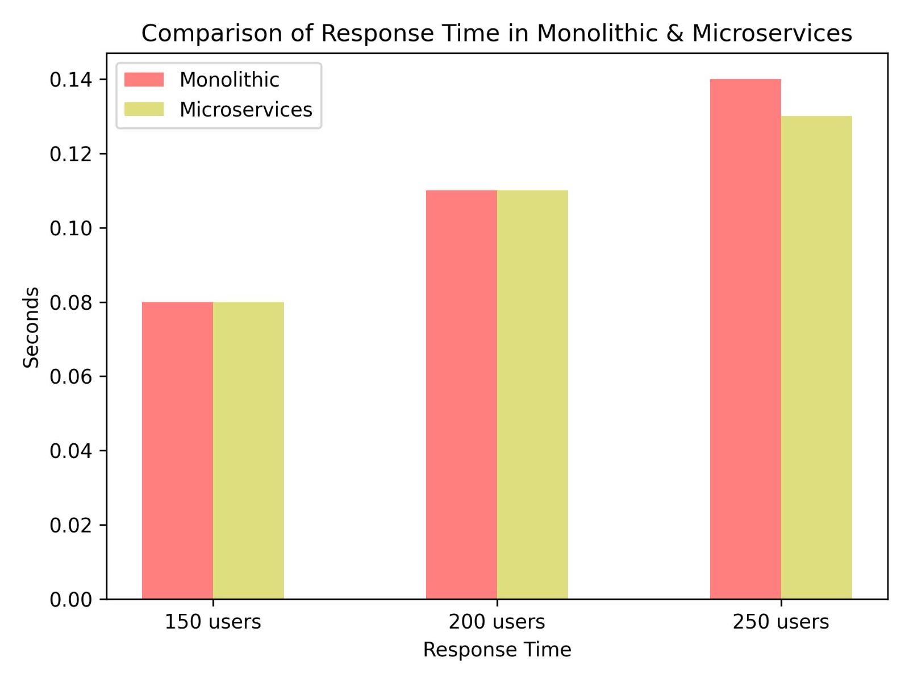

# CS6.401 Software Engineering Project 3

## Project Title -  CineStream - A Movie Streaming Platform

### Date -  29/04/2023

### Group Number -  11

| Name | Roll Number | Email |
| ---- | ----------- | ----- |
| Ben Paul| 2020101115     | ben.varghese@students.iiit.ac.in|
| Aayush Bhandari | 2020101116         | aayush.bhandari@students.iiit.ac.in |
| Swetha Vipparla | 2020101121         | swetha.vipparla@students.iiit.ac.in |
| Rohan Chowdary | 2020101130         | rohan.modepalle@students.iiit.ac.in |
| Shubh Agarwal | 2020101131         | shubh.agarwal@students.iiit.ac.in |

# Requirements Refinement

## Functional Requirements:
- The system should allow users to register and login with their credentials.
- The system should provide a platform for users to watch movies from different OTT providers by paying a nominal rent or a subscription fee.
- The system should allow users to request movies on the platform and make them available based on availability.
- The system should enable users to provide ratings, likes/dislikes and reviews for the movies they watch.
- The system should present users with personalized recommendations based on their preferences and metrics.
- The system should support different types of workloads and streaming content from different OTT providers.
- The system should restrict one user to stream content from only one platform at a time and from only two devices at a time.
- The system should provide a platform for viewing CineStream original content.

## Non-functional Requirements:
- The system should provide a seamless and quality experience to the users by handling the continuous inflow of data from different streaming platforms.
- The system should be scalable and reliable to handle the increasing number of users and content providers and provide for users across different devices and networks.
- The users should be able to view the content and navigate through the website without any delay in response time. The recommendations should be provided quickly by calibrating the user’s history after every watch or rating of a movie.
- The system should be secure and protect the privacy of the users and the content providers by not storing any sensitive data related to the users.
- The system should be environment friendly and use appropriate means to reduce the energy consumption or carbon footprint.
- The system should provide easy means for admins/maintenance team to access different analytics with respect to platform use.

## Architecturally Significant Requirements:
- The system should support different types of workloads and streaming content from different OTT providers. This is a key requirement because it affects the design of the system in terms of how to handle the integration, communication, and synchronization with different OTT providers’ APIs and data formats. It also impacts the performance, scalability, and reliability of the system as it needs to handle varying demands and loads from different sources.  It affects the choice of architecture style, deployment model, load balancing strategy, caching mechanism, etc.
- The system should not store any sensitive data related to the users and ensure their privacy and security. This is a key requirement because it affects the choice of authentication method, encryption technique, data protection policy, etc. It also impacts the compliance, trustworthiness and reputation of the system.
- The system should be scalable and reliable to handle the increasing number of users and content providers and provide for users across different devices and networks.

# Architecture Design

# Informal Description of your system and its Software/System Architecture

CineStream is an OTT platform that enables users to enjoy a wide selection of movies and other content from various OTT providers. Users can opt for a flexible subscription scheme, receive personalized recommendations, and request movies. They can also provide feedback and ratings for the content they watch, and the platform leverages user metrics to enhance the user experience. The platform is scalable and can accommodate different workloads and OTT providers. It is also environmentally conscious and consumes minimal energy and has a low carbon footprint.

## Based on the requirements, these are the main susbsystems we have identified:
- User Interface Subsystem: This subsystem is responsible for providing a user-friendly and interactive interface for the users to watch movies, request movies, provide feedback, and get recommendations. It communicates with the other subsystems to display the relevant information and options to the users.
- Streaming Subsystem: This subsystem is responsible for handling the streaming data from different OTT providers and delivering it to the users. It integrates with the OTT providers’ APIs and data formats and processes the data according to the user’s preferences and metrics. It also ensures the quality of service and user experience by optimizing the bandwidth, latency, and resolution of the streaming data.
- User Management Subsystem: This subsystem is responsible for storing and managing the data related to the users, movies, OTT providers, ratings, reviews, and recommendations. It uses appropriate data structures and databases to store and retrieve the data efficiently and effectively. It also ensures the security and privacy of the data by encrypting and anonymizing it.
- Analytics Subsystem: This subsystem is responsible for providing different analytics and insights to the admins/maintenance team regarding the platform use. It collects and analyzes the data from the other subsystems and generates various reports and dashboards to monitor and improve the performance, scalability, reliability, and usability of the system.

- Recommendation Subsystem: This subsystem is responsible for providing personalized recommendations to the users based on their preferences and metrics. It uses various algorithms and techniques to analyze the user’s behavior, feedback, and history and suggest movies that match their interests and tastes.

- Billing Subsystem: This subsystem is responsible for handling the payment and billing transactions between the users and the OTT providers. It uses various payment methods and gateways to process the payment requests and confirmations. It also manages the subscription plans and fees for the users and the OTT providers.
- Subscription Subsystem: This subsystem handles the users’ and OTT providers’ subscription plans and fees. It works with the billing subsystem to pay and verify the subscriptions. It also works with the OTT providers’ APIs to find out the different subscription plans and fees for each OTT provider. It lets the users pick and change their subscription plans and OTT providers.

Following is the high level diagram of the system:

The following is how our aechitecture addresses the key requirements:

- The system should support different types of workloads and streaming content from different OTT providers. This requirement addresses the system constraint of **interoperability**, which is the ability of the system to work with other systems or components without any special effort. The system needs to be able to integrate, communicate, and synchronize with different OTT providers’ APIs and data formats without compromising the quality or functionality of the system.
- The system should not store any sensitive data related to the users and ensure their privacy and security. This requirement addresses the system constraint of **security**, which is the ability of the system to protect itself and its data from unauthorized access, use, modification, or destruction. The system needs to implement appropriate authentication, encryption, data protection, and auditing mechanisms to ensure the privacy and security of the users and the content providers.
- The system should be scalable and reliable to handle the increasing number of users and content providers and provide for users across different devices and networks. This requirement addresses the system constraint of **scalability** and **reliability**, which are the abilities of the system to handle increasing or varying demands and loads without degrading its performance or functionality. The system needs to adopt a suitable architecture style, deployment model, load balancing strategy, caching mechanism, etc. to achieve scalability and reliability.

# Design Decisions

## Our major design decisions
- Decision 1: To use a microservices architecture style for developing and deploying the platform [ADR](ADR-1.md)
- Decision 2: To use MongoDB as the primary database for storing user and movie data. [ADR](ADR-2.md)
- Decision 3: To use Kafka as the message broker for enabling asynchronous and reliable communication between different services and components of the platform. [ADR](ADR-3.md)
- Decision 4: To use OAuth 2.0 framework for authenticating and authorizing users and OTT providers. [ADR](ADR-4.md)

# Stakeholders, Concerns, Viewpoints and Views

## Stakeholders:
- **Users:** These are the people who watch movies and other content on the CineStream platform.
- **OTT Platforms:** These are the businesses that supply content to CineStream through their APIs.
- **Production Companies:** These are the individuals or organizations that make the movies on the platform.
- **Advertisers:** These are the businesses that pay to display ads on the platform to reach potential customers.
- **Maintenance Teams:** These are the people in charge of developing, maintaining and managing the CineStream platform.
- **Management:** People responsible for the business goals and strategies of the platform.
- **Partners:** These are the businesses that collaborate with CineStream to provide complementary services or products, such as payment gateways or streaming devices.
- **Government Agencies:** These are the government agencies that regulate the content and operations of the platform. Their concerns could include compliance with relevant laws and regulations, such as those related to content rating and data privacy.

## Concerns:
- **Security:** The platform should ensure the security and privacy of user data.
- **Quality:** The quality of the content and the service provided by the platform.
- **Accessibility:** The ability of users with different abilities and preferences to access and use the platform.
- **Cost:** The value for money and understanding of the cost structure of using the system.
- **Energy Management:** The platform should be designed to minimize its carbon footprint and use energy-efficient design principles.
- **Performance:** The platform should be able to handle different types of workloads and provide fast response times.
- **Maintainability:** The ease of maintaining and updating the platform.
- **Functionality:** The features and functions provided by the platform.
- **Reliability:** The consistent and accurate performance of the system to meet the needs of stakeholders.
- **Data Privacy:** The protection of personal and sensitive information from unauthorized access and use.
- **Scalability:** The platform should be able to scale to accommodate a growing number of users and content.
- **Usability:** The platform should be user-friendly and provide a smooth experience to users.

## Concern–Stakeholder Traceability:

| Concerns | Users | OTT Platforms | Production Companies | Advertisers | Maintenance Teams | Management | Partners | Government Agencies |
| --- | --- | --- | --- | --- | --- | --- | --- | --- |
| Security | X | X | X | X | X | X | X | X |
| Quality | X | X | X |  |  | X |  |  |
| Accessibility | X |  |  |  | X | X |  |  |
| Cost | X |  |  |  |  | X | X |  |
| Energy Management |  |  |  |  | X | X |  |  |
| Performance | X | X |  |  | X | X | X|  |
| Maintainability|  |  |  |  | X | X |   |   |
| Functionality | X |   |   |   |   | X |   |   |
| Reliability | X | X |   |   |   | X |   |   |
| Data Privacy | X |   |   |   |   |   |   | X |
| Scalability |   |   |   |   | X | X |   |
| Usability | X | | | | | | | | |
---

## Viewpoints:

- **User Viewpoint:** This viewpoint focuses on the user experience and the functionality of the system. It describes how users can access and use the platform to watch movies and other content. It also covers the quality, performance, usability and accessibility aspects of the system.

- **Business Viewpoint:** This viewpoint focuses on the business goals and strategies of the system. It describes how the platform generates revenue and provides value to its customers and partners. It also covers the cost, scalability and reliability aspects of the system.

- **Technical Viewpoint:** This viewpoint focuses on the technical architecture and design of the system. It describes how the platform is built, maintained and operated using various technologies and tools. It also covers the security, energy management and maintainability aspects of the system.

- **Regulatory Viewpoint:** This viewpoint focuses on the legal and ethical aspects of the system. It describes how the platform complies with relevant laws and regulations regarding content rating, data privacy, taxation, etc. It also covers the social and environmental impacts of the system.

## Views:

- **User Interface View:** This view shows how the user interacts with the system through various interfaces, such as web browsers, mobile apps, smart TVs, etc. It describes the layout, navigation, functionality and appearance of the user interface. It addresses the concerns of users and management regarding functionality, usability and accessibility.

- **Business Process View:** This view shows how the system supports the business processes and workflows of the platform, such as content acquisition, delivery, monetization, analytics, etc. It describes the roles, responsibilities, activities and interactions of different actors involved in the business processes. It addresses the concerns of management, OTT platforms, production companies and advertisers regarding quality, cost, scalability and reliability.

- **Data View:** This view shows how the system manages and stores data from various sources, such as user profiles, content metadata, ratings, reviews, preferences, etc. It describes the data models, schemas, relationships and constraints of the data. It addresses the concerns of users, OTT platforms, production companies and government agencies regarding security and data privacy.

- **Deployment View:** This view shows how the system is deployed and distributed across different physical or virtual nodes, such as servers, clusters, containers, etc. It describes the configuration, communication and dependencies of different components and services that make up the system. It addresses the concerns of maintenance teams and partners regarding performance, energy management and maintainability.

- **Security View:** This view shows how the system protects itself and its data from unauthorized access and use. It describes the security policies, mechanisms and protocols that are applied at different levels of the system, such as authentication, authorization, encryption, auditing, etc. It addresses the concerns of all stakeholders regarding security.

- **Regulatory View:** This view shows how the system complies with relevant laws and regulations regarding content rating, data privacy, taxation, etc. It describes the compliance requirements, standards and guidelines that are followed by the system. It also covers the social and environmental impacts of the system. It addresses the concerns of government agencies and management regarding regulatory compliance.

# Architectural Tactics and Patterns

- **Microservices:** This is a pattern that decomposes the system into small, independent and loosely coupled services that communicate through well-defined interfaces. We plan to use this pattern to achieve scalability, reliability, maintainability and performance. Each service can be developed, deployed and scaled independently, allowing for faster delivery and easier fault isolation. The communication between services can be asynchronous or synchronous, depending on the requirements. For example, we can have separate services for content ingestion, transcoding, encryption, delivery, metadata, recommendation, etc.

- **API Gateway:** This is a pattern that provides a single entry point for all external requests to the system. It acts as a reverse proxy that routes requests to the appropriate microservices, handles authentication and authorization, performs load balancing and caching, and provides monitoring and logging. We plan to use this pattern to achieve security, performance and usability. The API gateway can enforce security policies and protect the system from malicious attacks. It can also improve performance by reducing network latency and bandwidth consumption. It can also provide a consistent and user-friendly interface for clients.

- **Circuit Breaker:** This is a tactic that monitors the availability and performance of a service or a dependency. It detects failures and prevents cascading failures by opening the circuit and stopping further requests until the service recovers. We plan to use this tactic to achieve reliability and performance. The circuit breaker can prevent the system from being overwhelmed by failing requests and allow it to gracefully degrade or failover.

- **Cache:** This is a tactic that stores frequently accessed or expensive data in a fast and local storage. It reduces the need to access remote or slow resources and improves performance and availability. We plan to use this tactic to achieve performance and scalability. The cache can reduce the load on the system and improve the response time for users. For example, we can cache content metadata, user preferences, recommendations, etc.

- **Encryption:** This is a tactic that transforms data into an unreadable form using a secret key. It protects data from unauthorized access and use. We plan to use this tactic to achieve security and data privacy. The encryption can be applied at different levels of the system, such as data in transit, data at rest, data in use, etc. For example, we can encrypt the content during ingestion, transcoding and delivery using DRM or AES encryption.

- **Audit:** This is a tactic that records the actions and events that occur in the system. It provides evidence of compliance, accountability and traceability. We plan to use this tactic to achieve security and regulatory compliance. The audit can be used to monitor the system activities, detect anomalies, enforce policies and report violations. For example, we can audit the content rating, user consent, payment transactions, etc.

Our plan is to apply the Microservices Architecture pattern to build CineStream.

The Microservices Architecture pattern consists of designing the system as a set of small, independent services that interact with each other using well-defined interfaces. Each service has a specific function and can be developed and deployed separately from the others.

This pattern could be suitable for CineStream because it offers several advantages such as:

-   Scalability: The system can be scaled easily by adding more instances of individual services to handle more demand.

-   Resilience: The system can be made more resilient by designing services to cope with failures and recover quickly.
  
-   Flexibility: The system can be changed easily by updating or replacing individual services without impacting the rest of the system.

By using this pattern we can achieve the non-functional requirements of scalability, resilience and flexibility. We can ensure security and privacy of data by using encryption and authentication mechanisms. We can handle different amounts of traffic by scaling individual services. We can also have much quicker response times because each service can be optimized for its specific function.

The C4 diagrams will look as follows:
- Context Diagram:
	
    The "Big Picture View" of the Cinestream system refers to an overview of the system's interactions with various stakeholders and external subsystems. In particular, the Cinestream system relies on three external systems, namely a Recommendation system, an Analytics system, and external OTT providers. These external systems play a crucial role in the overall functioning of the Cinestream system, as they provide important functionalities and services that enable users to stream movies and access personalized recommendations.

    The relationship between these subsystems is depicted in a diagram, which illustrates how they interact with one another to provide a seamless streaming experience for users. The Recommendation system uses pre-trained ML models and algorithms to provide personalized movie recommendations to users, while the Analytics system generates reports on key metrics such as user numbers, response times, and server utilization. External OTT providers such as Amazon Prime, Netflix, and Hotstar expose their APIs to allow for seamless streaming of movies within the Cinestream platform.
- Container Diagram:
    
    This high-level diagram illustrates the architecture of the Cinestream system, which is based on a microservices approach. It depicts the interactions between the Web Application (frontend) and separate microsystems, specifically the Streaming Management, Subscription Management, User Management, and Billing Management subsystems.

    The User Management subsystem interacts with the user database, which contains user details such as email and password, as well as user analytics.

    The Streaming Management subsystem is the primary microsystem that interacts with the content database, which contains movies exclusive to Cinestream subscribers. It relies on all external systems, such as Recommendations and External OTT Providers, to provide users with streaming services.

    The Subscription Management subsystem interacts with the subscription database, which stores user subscription details like the start date, subscription type (yearly or monthly), and a list of all movies that the user has paid for from external OTT platforms.

    The Billing Management subsystem manages all information regarding payment transactions and payment gateways. It ensures that all transactions are secure and accurate, and that all payments are processed efficiently.
- Streaming Microservice:
    
    The Streaming Management microsystem interacts with the content database, which contains all the movies available on the Cinestream platform. It enables users with a subscription to access the content and manages the streaming of the movies. The Streaming Management microsystem interacts with all the external systems, including the Recommendation system and external OTT providers, to ensure a seamless user experience.
- User Management Microservice:
    
    The subsystem referred to here is the User Management microsystem of the Cinestream system. Its primary responsibility is to manage and store data related to user accounts, including user email, password, and other personal information. In addition, it also stores data related to user activity such as watch history, preferences, and other analytics. This data is used to provide users with personalized recommendations, which is facilitated by the Recommendations subsystem.
- Subscription Microservice:
    
    The Subscription Management microsystem manages and stores data related to user subscriptions, including subscription start dates, types (yearly or monthly), and a list of all the movies a user has paid for from external OTT providers like Amazon Prime, Netflix, and Hotstar.
- Billing Microservice:
    
    The Billing Management subsystem is responsible for storing and managing all the information related to payment transactions, which includes details such as the amount paid, payment date, payment method used, and any associated transaction IDs. This subsystem also manages the payment gateways that are used by Cinestream to process transactions securely and efficiently. It ensures that the payment process is smooth and reliable, while also keeping track of any issues that may arise during the payment process. Additionally, it provides the necessary functionality to support billing-related tasks, such as generating invoices, handling refunds, and managing subscriptions.

# Architectural Analysis

- What part of the system is going to be analysed?
    3 microservices are analyzed and implemented in this project. They are User Management Microservice, Content Management Microservice and Subscription Management Microservice. These microservices are designed to be modular, scalable, and easy to deploy, and they communicate with each other through APIs.
	
- What Quality attributes will be analysed?

	The quality attributes or Non-Functional Requirements (NFRs) that will be analysed are 
	-	**Response time** which refers to the time it takes for a system to respond to a user's request or input, and is an important measure of system performance and usability. A system should have low response time in order to achieve good user experience & satisfaction.
	-	**Throughput** which refers to the amount of work that a system can perform over a given period of time and is usually measured in bytes/second. A system with high throughput is typically considered to be of higher quality than a system with low throughput, all other things being equal.
	-	**Transaction Rate** which refers to the number of transactions that a system can handle per unit of time, and it is an important measure of system performance, scalability, and reliability.
	-	**Concurrency** which refers to on average how many  were executed simultaneously the web server. Sometimes, high concurrency is a trait of a poorly functioning website. The longer it takes to process a transaction, the more likely they are to queue. When the queue swells, concurrency rises.

	To imitate users and send hundreds of API queries to our system at once, we used the Siege tool. It enables one to bombard a server with a set number of concurrent fake users.The following results were obtained by simulating concurrent users for 1 minute while they simultaneously made requests to all services, including registering new users, logging in users, downloading videos from local and other OTT platforms, checking users' subscriptions, and adding new subscriptions. 
	
	150 users for 1 minute:
	
	| Measure | Monolithic | Microservices |
	| ---------- | ------------- | ---------------- |
	| Response Time | 0.08s | 0.08s |
	| Throughput | 1.19 bytes/s | 1.02 bytes/s |
	| Transaction Rate | 1835.24 trans/sec | 1902.81 trans/sec | 

	200 users for 1 minute:

	| Measure | Monolithic | Microservices |
	| ---------- | ------------- | ---------------- |
	| Response Time | 0.11s | 0.11s |
	| Throughput | 1.13 bytes/s | 0.97 bytes/s |
	| Transaction Rate | 1742.06 trans/sec | 1806.61 trans/sec | 

	250 users for 1 minute:
	| Measure | Monolithic | Microservices |
	| ---------- | ------------- | ---------------- |
	| Response Time | 0.14s | 0.13s |
	| Throughput | 1.13 bytes/s | 1 bytes/s |
	| Transaction Rate | 1741.15 transc/sec | 1853.96 trans/sec | 

    Graphs:
	
	Comparison of Response Time:
	
	
	Comparison of Throughput:
	
	
	Comparison of Transaction Rate:
	

    - We've noticed very small decrease in the metrics of the nfrs from monolithic to microservices. This can be attributed to the fact that our implementation is done using javascript files in the form of mernstack. We were not able to find any tool that stress tested for more than 250 users. However, it would be reasonable to conclude that if the number of users is increased to 500 or 1000, the difference between the monolithic and microservices would be more pronounced.

# Bonus: From Architecture to Code

Please describe the prototype you implemented and explain how it supports your claims about the functional and non functional requirement of your project (Make use of diagrams and screenshots, don’t make this section verbose with too many details)

The prototype shall demonstrate that your architecture, when implemented, brings the quality characteristics you wanted/expected.

# Summary

Various sections of the document have discussed the design of the CineStream movie streaming service. The main characteristics and limitations of the system are outlined in the functional requirements, non-functional requirements, and architecturally significant requirements sections. An overview of the platform and its primary components is provided by the informal description of the system and its software/system architecture. The system's primary design decisions, such as the usage of a hybrid cloud model and a microservices architecture pattern, are discussed in the design decisions section. The section on stakeholders, concerns, viewpoints, and views lists the important parties involved, their main worries, and the viewpoints and views that are employed to meet those problems. The strategies utilised to meet the architecturally important requirements are described in the section on architectural strategies. A performance analysis of the system is given in the architectural analysis section, which also compares it to a monolithic architecture. Overall, the document offers a thorough explanation of the CineStream platform's design and architecture.